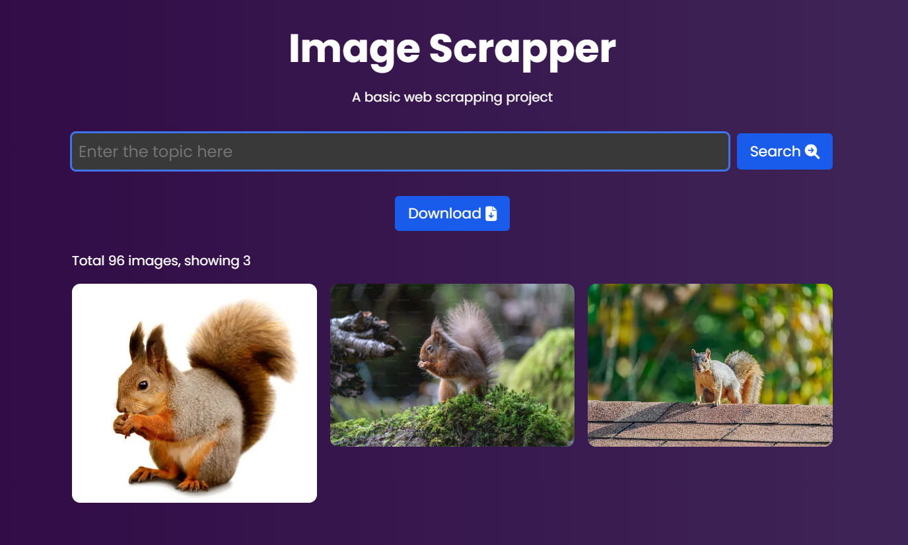

# Image scrapper

## Overview
This is a basic web scrapping project using `BeautifulSoup` and `Flask`.

## Features
- Scraping images from https://unsplash.com/
- Storing scraped images in a local folder
- Providing a downloadable link to a zip file containing all images

## Screenshots


## Technologies Used
- Python
- Flask
- Beautiful Soup

## Installation
1. Clone the repository:
   ```
   git clone https://github.com/Mainakcris7/image_scraper_bs4.git
   ```
2. Install dependencies:
   ```
   pip install -r requirements.txt
   ```

## Usage
1. Run the Flask app:
   ```
   python app.py
   ```
2. Open your web browser and go to `http://localhost:8080/`.
3. Enter the topic for the images you want to search.
4. Once the scraping process is complete, a download link for the zip file will be provided.
5. Click on the download link to download the zip file containing all the scraped images.

## File Structure
- `app.py`: Flask application file containing route definitions.
- `templates/`: Folder containing HTML templates for the web interface.
  - `index.html`: Main HTML file for the web interface.
- `static/`: Folder containing static files(CSS, JS, etc.) and also the image files.
- `requirements.txt`: File listing all Python dependencies.

## Contact
For any further query, please drop an email at mainakcr72002@gmail.com